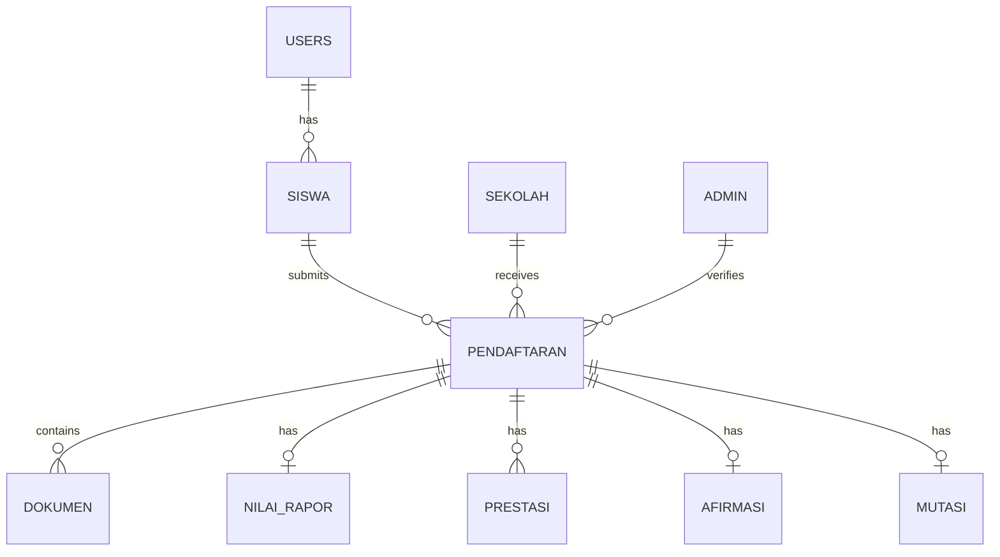

# Database Schema - PPDB SMA Negeri Kota Padang

## Entity Relationship Diagram (Simplified)



## Table Summary

| No | Tabel | Deskripsi |
|----|-------|-----------|
| 1 | `users` | Akun pendaftar (siswa/orang tua) |
| 2 | `admin` | Akun operator sekolah/dinas |
| 3 | `sekolah` | Data SMA Negeri beserta koordinat dan kuota |
| 4 | `siswa` | Data lengkap calon peserta didik |
| 5 | `pendaftaran` | Master pendaftaran PPDB |
| 6 | `dokumen` | Berkas-berkas yang diunggah |
| 7 | `nilai_rapor` | Nilai rapor (jalur prestasi akademik) |
| 8 | `prestasi` | Sertifikat prestasi (non-akademik) |
| 9 | `afirmasi` | Data tambahan jalur afirmasi |
| 10 | `mutasi` | Data tambahan jalur perpindahan |
| 11 | `jadwal` | Timeline kegiatan PPDB |
| 12 | `pengumuman` | Informasi dan pengumuman |
| 13 | `log_aktivitas` | Log audit aktivitas sistem |

## Installation

```bash
# Via MySQL Command Line
mysql -u root -p smapadang < database/schema.sql

# Via phpMyAdmin
1. Buat database 'smapadang'
2. Import file database/schema.sql
```

## Default Admin Login

| Username | Password |
|----------|----------|
| admin | admin123 |
